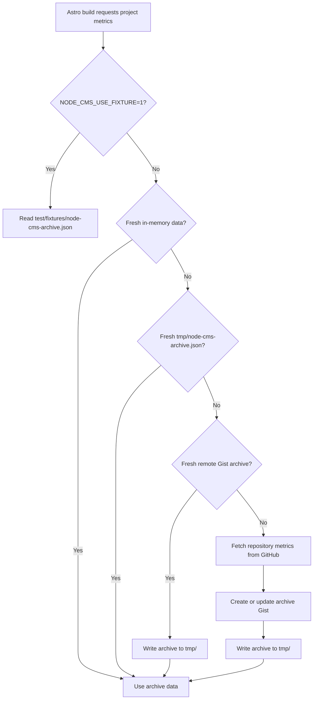

# Data Fetching

nodecms.guide stores project metadata in Markdown, but GitHub metrics are loaded
at build time. The build calls `scripts/fetch-archive.js` through Astro content
loading, then `scripts/project-data.js` calculates current values and trends.

## Local development

Use fixture mode when you need a token-free local build:

```bash
NODE_CMS_USE_FIXTURE=1 pnpm build
pnpm preview
```

Fixture mode reads `test/fixtures/node-cms-archive.json` and bypasses Octokit,
local archive reads, and Gist updates. This is also how pull request CI keeps
builds deterministic and avoids requiring repository secrets.

For a local build against live GitHub data, set `NODE_CMS_GITHUB_TOKEN` in a
root `.env` file before running `pnpm build`. The token must be able to create
and update Gists because the archive is stored remotely as a Gist.

## Archive flow

The fetcher checks data sources in this order:



1. `NODE_CMS_USE_FIXTURE=1` returns the checked-in fixture immediately.
2. A fresh in-memory result is reused within the same build process.
3. A fresh `tmp/node-cms-archive.json` local archive is reused.
4. A fresh remote Gist archive is downloaded and written to `tmp/`.
5. If no fresh archive exists, the build fetches repository metrics from GitHub,
   updates the remote Gist, writes `tmp/`, and uses that data.

Archives expire after 1410 minutes, which is 30 minutes short of 24 hours. Raw
archive history older than 30 days is discarded when the archive is updated.

## CI and production

Pull request CI runs build and E2E jobs with `NODE_CMS_USE_FIXTURE=1`, so PRs do
not need GitHub secrets and do not mutate the shared archive Gist.

The scheduled `Smoke (real GitHub)` workflow runs `pnpm build` with the
`NODE_CMS_GITHUB_TOKEN` repository secret. It proves the live GitHub and Gist
path still works, then checks that the archive is recent and contains project
data.

Netlify runs `pnpm build` and publishes `dist/`. Production and deploy-preview
builds rely on Netlify environment settings for `NODE_CMS_GITHUB_TOKEN`; when
live data needs to refresh, trigger a new Netlify deploy.
